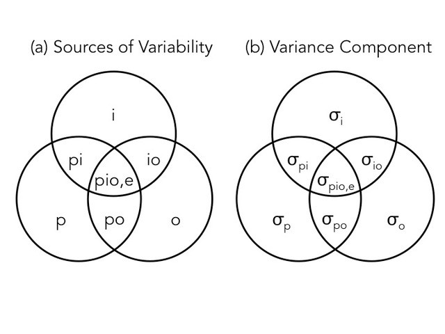
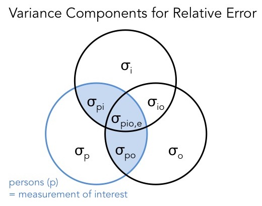

```{r setup, include=FALSE}
library(haven)
library(psych)
library(plyr)
library(reshape2)
library(lme4)
library(tidyr)
library(pander)
library(knitr)
library(ggplot2)

alpha <- psych::alpha

opts_chunk$set(echo = TRUE,tidy.opts=list(width.cutoff=80),tidy=TRUE,message=FALSE,warning=FALSE)

```

#Part 1: Classical Test Theory & Validation

##1) On the basis of this correlation, the researcher states that the reliability of the ratings is 0.7.  What _score_ is she assuming is relevant, that has a reliability of 0.7? Is it the score from e-Rater A? The score from e-Rater B? Some combination of both scores? A score from any single e-Rater? Or other?

The researcher is referring to the reliability of the scores generated by the population of e-Raters (or equivalently, scoring algorithms) for this specific essay prompt, from which e-Raters A and B came.  For example, we could imagine the company developing or acquiring another algoriithm called e-Rater C, whose pairwise correlations with A and B should be 0.7.  

##2) If the researcher considers 0.7 to be the reliability, what is the replication that she assumes is relevant?  What is random, and what is fixed?

The replication is the scoring process involving a random e-Rater (or, scoring algorithm).  The e-Rater/scoring algorithm is random, but the students' abilities, form, and testing occasion are fixed.

##3) Apply Spearman-Brown (actually perform a calculation) to estimate the reliability of the average these two e-Rater scores.

```{r}
#create function to calculate Spearman-Brown
SB_Rho<-function(k,rho){
  return(k*rho/(1+(k-1)*rho))
}
  
# conceptually, this is the corr between two sets of e-Raters A&B and C&D
pander(paste0("Spearman-Brown Rho: ", round(SB_Rho(2,.7),2))) 
```

\newpage
##4) The company asks you what a valid use of the third score would be. Remember this score is available for only 10\% of examinees. Should the company use this score alone? Should it use the unweighted average of the three scores (the two e-rater scores and the human score)?  Should it ignore the score and use the average of the two e-Rater scores?  Answer the following questions:
    
###a) If you were an examinee with a high (well above average) true score, would you rather have the human score, the average of the two e-rater scores, or the average of all three scores?

We would want the average of all three scores to minimize the error variance.

###b) If you were an examinee with a low (well below average) true score, would you rather have the human score, the average of the two e-rater scores, or the average of all three scores? 
  
Because we can assume the human score is equally accurate and equally covarying with the e-Raters, we would rather have the single human score.  This gives me a higher chance of having a large error to potentially mask my low "true score."  
  
###c) Weighing all considerations for the intended use of these scores for college admissions, what would be your recommendation to the company for how they should use this third score?
  
We recommend ignoring the third score and only use the average of the e-Raters for admissions purposes.  Since this third score is only available for 10% of students, by averaging scores for that subgroup, we'd increase the precision (i.e., reduce the error variance) for their scores.  That is, for 10% of people, they're more likely to be disadvantaged if their true score is low and more likely to be advantaged if their true score is high. Since this advantage/diadvantage is not available to the rest of the sample, it would be unfair.   
  
\newpage
#Part 2: Classical Test Theory and Exploratory Analysis
```{r,echo=T}
#Read in data
data_raw<- read_dta("./Assignment1.dta")
```

##5) Using Stata, calculate coefficient alpha for the first occasion and the second occasion separately.   In a sentence or two, interpret coefficient alpha for the first occasion (see also Question 16).
```{r,echo=T}
#create variable lists
o1 <- paste0("x_o1_i", 1:12)
o2 <- paste0("x_o2_i", 1:12)
#subset data
data_o1 <- subset(data_raw, select = o1)
data_o2 <- subset(data_raw, select = o2)
#create alpha output
alpha1 <- alpha(data_o1)
alpha2 <- alpha(data_o2, keys=NULL, title=NULL, cumulative=FALSE, max=10, na.rm = TRUE, check.keys=TRUE, n.iter=1, delete=TRUE)
#get just the alpha numbers
alpha_time1 <- alpha1$total$std.alpha
alpha_time2 <- alpha2$total$std.alpha
#output alpha data
# alpha1
# alpha2
```

```{r,echo=F}
pander(summary(alpha1),caption="First occasion")
pander(alpha2[c(2)],caption="Alphas with deletions")

pander(summary(alpha2),caption="Second occasion")
pander(alpha1[c(2)],caption="Alphas with deletions")
```
 
For this sample $\alpha_1 = `r round(alpha_time1,3)`$ and $\alpha_2 = `r round(alpha_time2,3)`$

##6) Using Stata, calculate the average score of participants from the first occasion, then calculate the average score of participants from the second occasion. Then, calculate the correlation between the two average scores using code like pwcorr avgscr1 avgscr2.  Report this correlation and, in a sentence or two, provide an interpretation (see also Question 16).
```{r}
avg_o1 <- rowMeans(data_o1)
avg_o2 <- rowMeans(data_o2)

cor(avg_o1, avg_o2)
```

##7) Reload the data and reshape it for analysis in Stata.  Although it is a pain, I am requiring you to use some of the code that we have presented in the past .do files to reshape the data from “double-wide” format.  See, for example, the Class03.do and Class04.do files.  As one way to check your work, submit a screenshot of the output from code like table person item occasion, contents(mean score) and/or simply table person item occasion .

```{r,echo=T}

data_raw$person <- factor(data_raw$person)
colnames(data_raw) <- c("person", paste0("1_",1:12), paste0("2_",1:12))

data_long <- melt(data_raw, id.vars=c("person"))
data_long <- separate(data = data_long, col = variable, into = c("occasion", "item"), sep = "_")
```

##8) Note the code available to you in the .do files, and include a) a discrete histogram of all 25x12x2 scores, b) a histogram of marginal person scores, c) a histogram of marginal item scores, and d) a histogram of marginal occasion scores.  Use discrete histograms where you think they are appropriate, or substitute tables if histograms are not informative, for example, tabulate occasion, summarize(score) .  Histograms of interactions are not necessary.

\newpage
#Part 3: The Generalizability Study

##9) Write out the model implied by the data collection design under the tenets of Generalizability Theory.  Draw the Venn diagram for this design.

The model implied here can be written as
\begin{align*}
X_{pi}&=\mu + \nu_p + \nu_i +\nu_o+ \nu_{pi}+ \nu_{po}+ \nu_{oi}+ \nu_{pio,e}\\
\nu_p&\sim N(0,\sigma^2_p)\\
\nu_i&\sim N(0,\sigma^2_i)\\
\nu_o&\sim N(0,\sigma^2_o)\\
\nu_{pi}&\sim N(0,\sigma^2_{pi})\\
\nu_{po}&\sim N(0,\sigma^2_{po})\\
\nu_{io}&\sim N(0,\sigma^2_{io})\\
\nu_{pio,e}&\sim N(0,\sigma^2_{pio,e})
\end{align*}

The Venn diagram for the variances is seen below:
 
```{r,echo=F,fig.align='center',fig.width=5,fig.height=3}

```

##10) Estimate the variance components for this model using the mixed or xtmixed command. Feel free to go get coffee while this runs.  Don’t forget to create interactions using commands like egen pXi = group(person item).  Include a table with four columns, the source of variance, the estimated variance components, their square roots, and their percentage of total score variance.

```{r,echo=T}

data_long$pxi <- as.factor(100*as.numeric(data_long$person)+as.numeric(data_long$item))
data_long$pxo <- as.factor(100*as.numeric(data_long$person)+as.numeric(data_long$occasion))
data_long$oxi <- as.factor(10*as.numeric(data_long$occasion)+as.numeric(data_long$item))

mixed <- lmer(value ~ 1 + (1|person) + (1|item) + (1|occasion) + (1|pxi) + 
                (1|pxo) + (1|oxi) ,data=data_long)

summary(mixed)
```


##11) A novice psychometrician with no sense of the context observes from the percentages, “it looks like items are a much greater source of variance than occasions!”  Explain the flaw in this reasoning.

The novice is not taking into account the fact that there are many more items than occasions. Moreover, the cost of adding additional items may be quite low, especially as compared to adding another test. 

##12) Estimate the Mean Squares for this model using the anova command.  You will first need to set the maximum matrix size to a large number, using code like set matsize 1000. Write out the equation for the estimated variance component, $\hat{\sigma^2_p}$, in terms of mean squares, $MS$, and confirm that this calculation corresponds to your results from mixed or xtmixed.  Recall that $n_p =25, n_i=12$ and $n_o=2$.

```{r}
anovlm <- lm(value ~ person + item + occasion +
               pxi + pxo + oxi,data=data_long )

anova(anovlm)
```

The equation for finding $\hat{\sigma}^2_p$ is $$\frac{MS_p-MS_{pi}-MS_{po}+MS_{pio,e}}{n_in_o}$$
plugging in the Mean Squares and $n$s from our ANOVA, we find that the estimated variance component is $$\hat{\sigma}^2_p=\frac{16.7-1.72-1.97+.74}{12\cdot 2}=.5729$$
This is basically the same as the answer we recieved from the mixed model. 

##13) Calculate and report the mean and standard deviation of marginal person scores, averaging over items and occasions.  Following the code from class, you could obtain this using code like, summarize pmean if ptag .  Explain why the term $\hat{\sigma_p}$, is less than the standard deviation of marginal person means.

 

```{r}
#get marginal person scores

marg_person <- ddply(data_long,"person",summarise,mean_p=mean(value))

#mean person score
round(mean(marg_person$mean_p),3)
#variance of person scores
round(sd(marg_person$mean_p),3)
```
The estimate for $\sigma_p$ is smaller than our calcluated standard deviation here (.757 vs .834) because the variance across people also includes the variance of people interacted with items, people interacted with occasions, and people interacted with both (plus random error). The whole point of G-theory is to separate these components out and so we would be remiss to assume that this standard deviation of person scores is all attributable to true differences in their scores. 

##14) Describe the $o$, $po$, and $io$ variance components in words, and include whether they are good, bad, or neutral with respect to relative error in a $p \times i \times o$ design.   There is no need to reference the actual values, here.

The $o$ variance component describes variance across occasions (constant across persons and items). This is ostensibly neutral as long as it affects all people equally. At the same time, we would prefer it to be smaller as it adds undesirable noise if we want to use the test score in an absolute setting. In contrast, the $po$ variance component is definitely bad, as it obfuscates both relative and absolute positions of persons across testing occasions. Finally, $oi$ variance is fairly benign. While it's not a good thing that items change across time, if it does not affect different people differently, then it will not alter peoples' relative scores. 

\newpage
#Part 4: The Decision Study

##15) Write out the full equation for the relative error variance, $\sigma^2_\delta$

As a rule, we know that any source of variability that intersects with the object of measurement (in this case persons) will change the measurement's relative position. In the case of a $p \times i \times o$ design, the relative error variance will include $\sigma^2_{pi}$, $\sigma^2_{po}$, and $\sigma^2_{pio,e}$ (see Figure). These variance components refer to single-unit replications, so we must divide by the relevant number of items and occasions to obtain error for average scores (over items and occasions). So the full equation for relative error variance is:

$$\sigma^2_\delta=\frac{\sigma^2_{pi}}{n'_i}+\frac{\sigma^2_{po}}{n'_o} + \frac{\sigma^2_{pio,e}}{n'_i n'_o}$$
where $n'i$ and $n'o$ are the number of items and number of occasions of a hypothetical (') test design (what \emph{could be} rather than what \emph{was} in the G-study data).

From Question 10, we know that $\sigma^2_{pi}=0.487$, $\sigma^2_{po} = 0.102$, and $\sigma^2_{pio,e} = 0.741$. So we can calculate $\sigma^2_\delta=\frac{0.487}{12}+\frac{0.102}{2} + \frac{0.741}{12 \times 2}=0.122$ for 12 items and two occasions. 


```{r,echo=F,fig.align='center',fig.width=5,fig.height=3}

```


##16) Calculate the generalizability coefficient for relative error, $E\hat{\rho}^2$, when there are 12 items administered on one occasion.  Explain the differences between this coefficient, the coefficients from Question 5, and the coefficient from Question 6.  Explain the differences between the questions that these different coefficients answer.

The generalization coefficient for relative error, $E\hat{\rho}^2 = \frac{\sigma^2_p}{\sigma^2_p + \sigma^2_\delta}$.

And from Question 15, we know ${\sigma^2_p}= 0.573$. Plugging in these numbers into the above equation we get:
$$E\hat{\rho}^2 = \frac{0.573}{0.573 + 0.122}=0.824$$
The relative error does not include error terms $\sigma^2_i$ or $\sigma^2_o$ because variation across items or occasions, respectively, are the same for every person. Items that are more difficult will be more difficult for all persons and occasions whith distractions will be more difficult for all persons. Therefore, they do not affect the relative position of one person to another. The same is true for variability for item-occasion interactions ($\sigma^2_{io}$).


##17) Use the “$p \times i \times r$ D Study Template” to include a graph of a) the standard error of measurement and b) the generalizability coefficient for relative error. Relabel and rescale where appropriate.

```{r,echo=T}
## This is a function to generate the relative error
## coefficient given a model, a number of raters and 
## a number of items. One weakness is that it presumes
## the names of your predictors and so is not suitable for
## general use. It does do the math correctly though and matches
## the output from Andrew's spreadsheet!

relative_error <- function(mod,raters,items) {
  
  sdvar <- as.data.frame(VarCorr(mod))
  sdvar$varComp <- sdvar$sdcor^2
  p <- sdvar$varComp[sdvar$grp=="person"]
  o <- sdvar$varComp[sdvar$grp=="occasion"]
  i <- sdvar$varComp[sdvar$grp=="item"]
  pxi <- sdvar$varComp[sdvar$grp=="pxi"]
  pxo <- sdvar$varComp[sdvar$grp=="pxo"]
  oxi <- sdvar$varComp[sdvar$grp=="oxi"]
  err <- sdvar$varComp[sdvar$grp=="Residual"]
  
  rel_err <- (pxi/items)+(pxo/raters)+(err/(items*raters))
  return(rel_err)
}

ggplot()+
  geom_line(aes(x=c(1:12),y=relative_error(mixed,1,1:12),colour="One Times"))+
  geom_line(aes(x=c(1:12),y=relative_error(mixed,2,1:12),colour="Two Times")) +
  geom_line(aes(x=c(1:12),y=relative_error(mixed,3,1:12),colour="Three Times")) +
  geom_line(aes(x=c(1:12),y=relative_error(mixed,4,1:12),colour="Four Times")) +
  geom_line(aes(x=c(1:12),y=relative_error(mixed,5,1:12),colour="Five Times")) +
  xlab("Number of Items") + ylab("Standard Error of Measurement") +
  ggtitle("Standard Error of Measurement Across Times and Items")

##This function opperates the same way as the one above, it
## just adds in the next step to generate the generalizability
## coefficient
rel_coeff <- function(mod,raters,items) {
  
  sdvar <- as.data.frame(VarCorr(mod))
  sdvar$varComp <- sdvar$sdcor^2
  p <- sdvar$varComp[sdvar$grp=="person"]
  o <- sdvar$varComp[sdvar$grp=="occasion"]
  i <- sdvar$varComp[sdvar$grp=="item"]
  pxi <- sdvar$varComp[sdvar$grp=="pxi"]
  pxo <- sdvar$varComp[sdvar$grp=="pxo"]
  oxi <- sdvar$varComp[sdvar$grp=="oxi"]
  err <- sdvar$varComp[sdvar$grp=="Residual"]
  
  rel_err <- (pxi/items)+(pxo/raters)+(err/(items*raters))
  gcoef <- (p/(p+rel_err))
  return(gcoef)
}


ggplot()+
  geom_line(aes(x=c(1:12),y=rel_coeff(mixed,1,1:12),colour="One Times"))+
  geom_line(aes(x=c(1:12),y=rel_coeff(mixed,2,1:12),colour="Two Times")) +
  geom_line(aes(x=c(1:12),y=rel_coeff(mixed,3,1:12),colour="Three Times")) +
  geom_line(aes(x=c(1:12),y=rel_coeff(mixed,4,1:12),colour="Four Times")) +
  geom_line(aes(x=c(1:12),y=rel_coeff(mixed,5,1:12),colour="Five Times")) +
  xlab("Number of Items") + ylab("Reliability Coefficient") +
  ggtitle("Reliability Coefficient Across Times and Items")

```

##18) If the scale is administered on 1 occasion, how many items are required to achieve a reliability of 0.75? You can use the template to answer this.

Using the formula above, and starting with 13 items (seeing that the green line on the second graph doesn't reach .75), we found that 14 items would be needed to reach a reliability of .751. 

##19) Compare the benefits of doubling the number of items from 6 to 12 versus doubling the number of occasions from 1 to 2.  Compare the benefits of doubling the number of items from 12 to 24 versus doubling the number of occasions from 1 to 2.  How could you use this information to address the question of whether items are a greater source of error than occasions?

```{r}
rel_coeff(mixed,6,1)
rel_coeff(mixed,12,1)
rel_coeff(mixed,6,2)
```
In the above calculations, we examine the possibilty of moving from 6 to twelve items (holding the occasions constant at 1), versus moving from 1 to 2 occasions (holding the items constant at 6). It seems clear that increasing the number of occasions yeilds greater benefits than increasing the number of items. At the same time, the cost of administering an additional test seems much higher than the cost of administering additional items. 

```{r}
rel_coeff(mixed,12,1)
rel_coeff(mixed,24,1)
rel_coeff(mixed,12,2)
```
This second test, which involves a larger baseline of items provides similar results. Doubling the number of items results in a much smaller increase in reliability as compared to doubling occasions. In fact, it appears as though the marginal impact of going from 12-24 is smaller than the benefit of going from 6-12 (this makes sense given the shape of the graph from number 17). It seems clear that occasions are a much greater source of error --- that is more error can be eliminated by increasing occasions --- than items.  
 